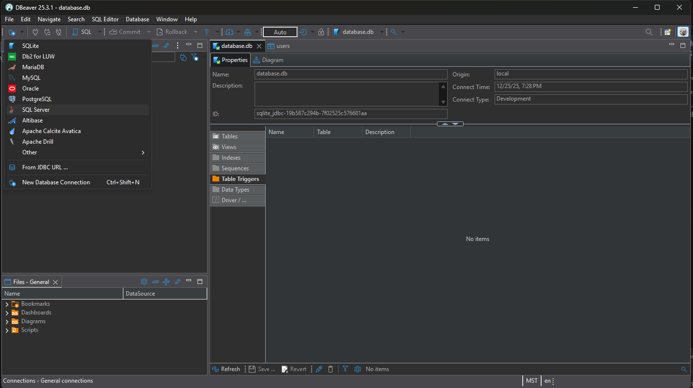
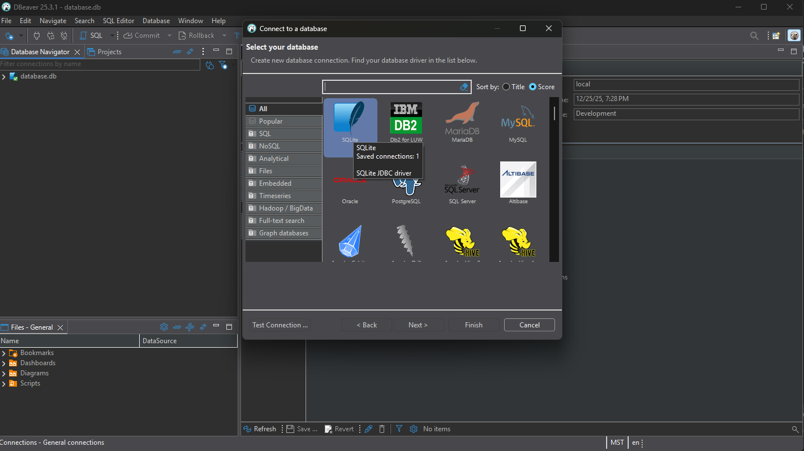

# Grain-Insight-Clifton

node version: v20.19.6

python version: v3.11

# Backend Setup (FastAPI)

This project uses **uv** for Python dependency management

### Install uv

Please install `uv` once before setting up the backend.

https://docs.astral.sh/uv/getting-started/installation/

### Install Backend Dependencies

After cloning the repository:

```
cd backend
uv sync
```
### Configure Environment Variables
Copy the example environment file:
```
cd backend
cp .env.example .env
```
Generate a secure JWT SECRET_KEY:
```
python -c "import secrets; print(secrets.token_hex(32))"
```
Update your .env file with the generated key
### Config interpretor

```
backend\.venv\Scripts\python.exe
```

### Run the Backend Server

This project starts the API by running the `main.py` file.

```
uv run python main.py
```

The API will be available at: http://localhost:8000

# Create/Update Tables

Whenever you make changes to your models, run this command to generate a migration script that keeps your database schema in sync with your models.

```
uv run alembic revision --autogenerate
```

This command applies the latest migration(s) to your database

```
uv run alembic upgrade head
```

This command applies the latest migration(s) to your database

# Run Seeder

```
cd backend

uv run python -m db.seeders.seed_all
```

# Github Actions

Check frontend format

```
npm run format && npm run lint
```

Check python code format

```
uv run ruff check . --fix
uv run black .
```

# Frontend UI

This project uses [daisyUI](https://daisyui.com/)

The default daisyUI theme is set to **corporate**

# Database Switching Logic Explanation

This project switches the database connection method based on the value of the `DEBUG` configuration:

## 1. When DEBUG=True

- Directly uses the `DATABASE_URL` configured in the `.env` file.
- Suitable for local development and testing environments.
- Example:
  ```env
  DATABASE_URL=sqlite:///./database.db
  DEBUG=True
  ```
- This will connect to a local SQLite database.

## 2. When DEBUG=False

- Ignores the `DATABASE_URL` in the `.env` file and dynamically constructs the PostgreSQL connection string using the following environment variables:
  - `DB_USER`
  - `DB_PASSWORD`
  - `DB_HOST`
  - `DB_PORT`
  - `DB_NAME`
- Suitable for production environments.
- This will connect to a remote PostgreSQL database.

## 3. Code Snippet

Relevant logic is in `core/config.py`

To switch databases, simply modify the `DEBUG` and related variables in the `.env` file.

# DBeaver

DBeaver supports various database types (such as SQLite, PostgreSQL, MySQL, etc.).

## 1. Download

https://dbeaver.io/download/

## 2. Connect to SQLite Database






