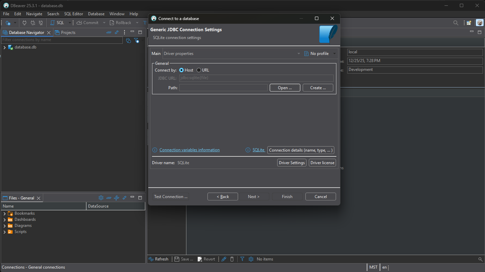
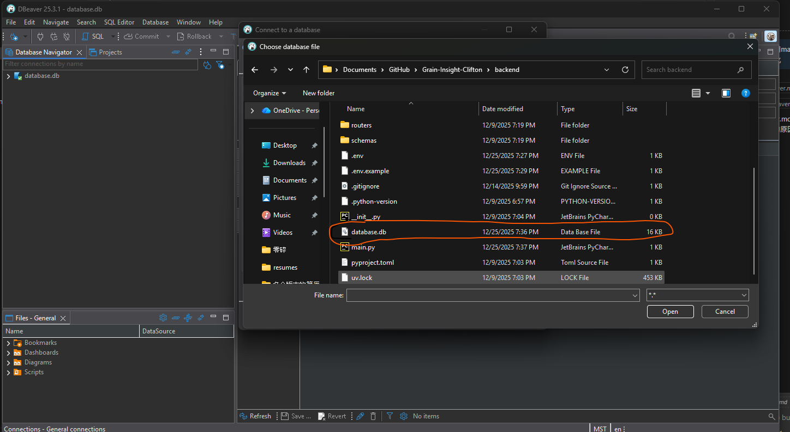

# 为什么推荐使用 DBeaver 进行数据可视化

DBeaver 是一款强大的数据库管理和数据可视化工具，适用于多种数据库类型（如 SQLite、PostgreSQL、MySQL 等）。推荐使用 DBeaver 进行数据可视化，主要有以下原因：

## 1. 下载

https://dbeaver.io/download/

## 2. 连接 SQLite 数据库

## 3. 注册表

在使用 SQLAlchemy 自动创建数据表时，调用 create_tables() 只会为已被 Base 注册的模型类创建表。只有在 main.py 或其他被执行的文件中 import 了这些 model（如 `from models import user, job`），SQLAlchemy 才能“发现”这些模型并注册到 Base。否则，即使调用 create_tables()，也不会创建相应的数据表。

因此，务必确保所有需要创建的数据表对应的模型类都被 import 到项目的某个地方（如 `main.py` 或 `router`），这样 create_tables() 才能正常工作，所有表才能被正确创建。
